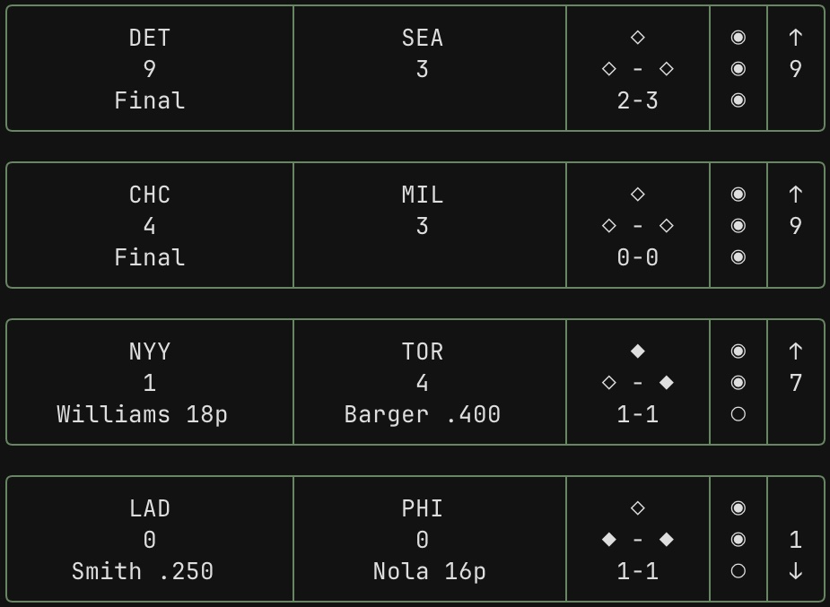

# Projects
| | |
|---:|:---|
| **Scorebug.sh** View MLB scores live in your terminal with scorebug.sh | |
|  |  **Candlerun** I made Candlerun for the Godot Wild Jam #64. My first game jam completion! |
